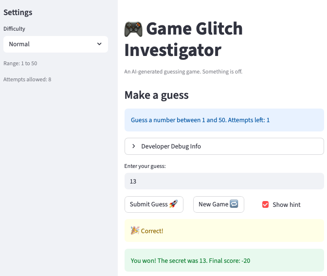

# 🎮 Game Glitch Investigator: The Impossible Guesser

## 🚨 The Situation

You asked an AI to build a simple "Number Guessing Game" using Streamlit.
It wrote the code, ran away, and now the game is unplayable. 

- You can't win.
- The hints lie to you.
- The secret number seems to have commitment issues.

## 🛠️ Setup

1. Install dependencies: `pip install -r requirements.txt`
2. Run the broken app: `python -m streamlit run app.py`

## 🕵️‍♂️ Your Mission

1. **Play the game.** Open the "Developer Debug Info" tab in the app to see the secret number. Try to win.
2. **Find the State Bug.** Why does the secret number change every time you click "Submit"? Ask ChatGPT: *"How do I keep a variable from resetting in Streamlit when I click a button?"*
3. **Fix the Logic.** The hints ("Higher/Lower") are wrong. Fix them.
4. **Refactor & Test.** - Move the logic into `logic_utils.py`.
   - Run `pytest` in your terminal.
   - Keep fixing until all tests pass!

## 📝 Document Your Experience

### Game Purpose
This is a number guessing game built with Streamlit. The player selects a difficulty level and tries to guess a secret number within a limited number of attempts. After each guess, the game gives a hint ("Go HIGHER" or "Go LOWER") and tracks a score that decreases with wrong guesses.

### Bugs Found
1. **Backwards hints** — "Too High" told the player to go higher instead of lower, and vice versa.
2. **Wrong difficulty ranges** — Hard mode used range 1–50, which was easier than Normal's 1–100.
3. **Score rewarded wrong guesses** — Even-numbered "Too High" attempts incorrectly added 5 points.
4. **Secret cast to string on even attempts** — The secret was converted to a string every other attempt, causing incorrect comparisons.
5. **Secret exposed in debug expander** — `st.write("Secret:")` showed the answer to the player at all times.
6. **New Game reset attempts to 0** — Should have reset to 1 to match the initial game state.
7. **`logic_utils.py` was all stubs** — Every function raised `NotImplementedError`, making tests crash.
8. **Tests compared string vs tuple** — `check_guess` returns a tuple but tests compared against a plain string.
9. **Info banner hardcoded range** — Always said "1 to 100" regardless of difficulty.
10. **New Game ignored difficulty range** — Always generated a secret from 1–100 instead of using `low`/`high`.

### Fixes Applied
- Corrected hint messages in `check_guess` so "Too High" > "Go LOWER" and "Too Low" > "Go HIGHER".
- Fixed difficulty ranges so Hard (1–100) is harder than Normal (1–50) and Easy (1–20).
- Removed the even-attempt score bonus; wrong guesses now always deduct 5 points.
- Removed the even/odd branch that cast the secret to a string; secret is always kept as an int.
- Removed `st.write("Secret:")` from the debug expander so the answer stays hidden.
- Reset attempts to 1 (not 0) on New Game to match the initial state.
- Moved all game logic functions from `app.py` into `logic_utils.py` and imported them.
- Fixed tests to use `[0]` to extract the outcome string from the returned tuple.
- Updated the info banner to use `{low}` and `{high}` variables instead of hardcoded values.
- Updated New Game to use `random.randint(low, high)` to respect the selected difficulty.

## 📸 Demo

## 🚀 Stretch Features

- [ ] [If you choose to complete Challenge 4, insert a screenshot of your Enhanced Game UI here]
